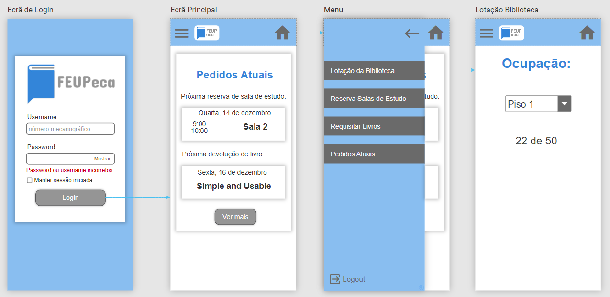
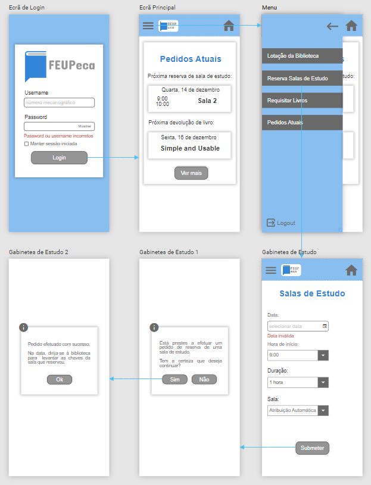
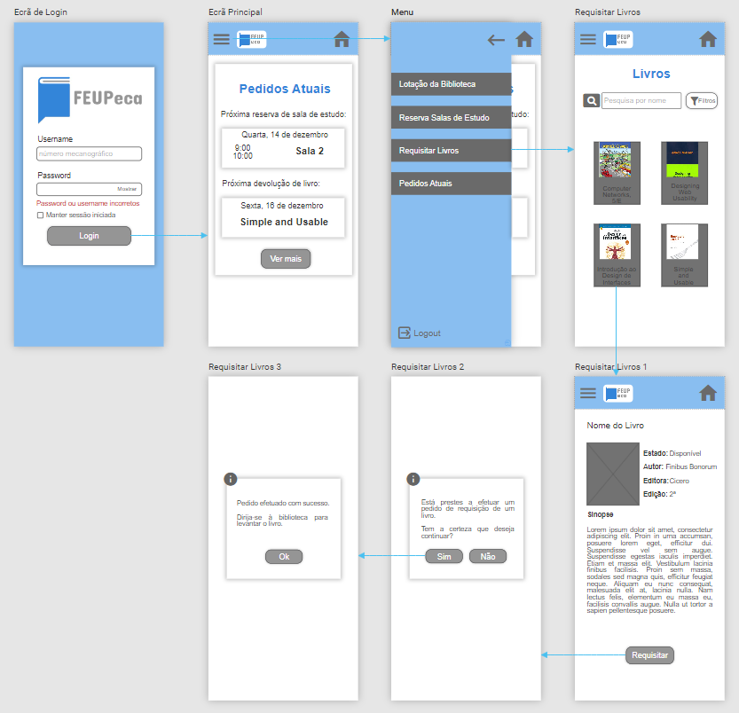
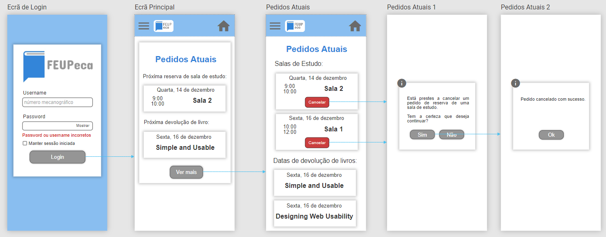

# IPC

> **FEUPeca** - Mobile app interface for the FEUP library

> [Prototype link](https://app.quant-ux.com/#/share.html?h=a2aa10a8UzM3xpsiYv7c5bDyMc5yyFYKjorpRKJ9A2PXH1BatE15ET8eKDle)

## Phases

The project was divided in three incremental phases:

- [Phase 1 - User and Task Analysis](https://github.com/ICWeiner/FEUP-IPC/tree/main/phase1)
- [Phase 2 - First Prototype and Heuristic Evaluation](https://github.com/ICWeiner/FEUP-IPC/tree/main/phase2)
- [Phase 3 - Second Prototype and User Evaluation](https://github.com/ICWeiner/FEUP-IPC/tree/main/phase3)

## Prototype wireflow

### Task 3 - Consulta de lotação

### Task 2 - Reserva de sala

### Task 1 - Requisição de livro

### Extra task - Pedidos atuais

## Group
- [Diogo Faia Nunes](https://github.com/ICWeiner)  
- [Daniela Tomás](https://github.com/DanielaTomas)  
- [Miguel Tavares](https://github.com/Miggs7)  

